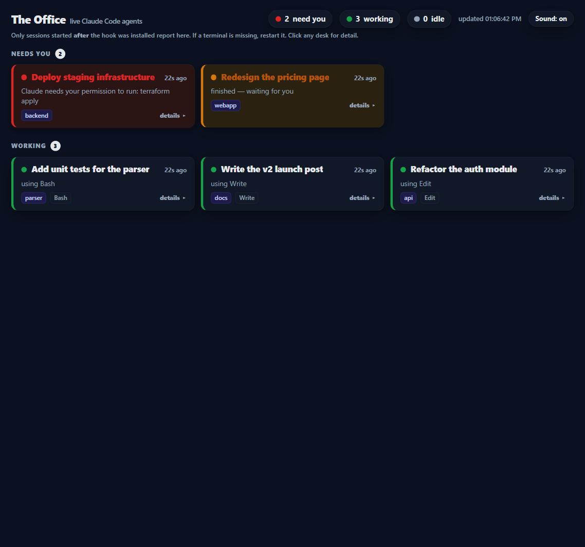

# The Office

**Run your Claude Code sessions as a team instead of a pile of terminals.**

One board shows every session you have open and which one needs you. Every session knows who its teammates are and what they are working on, so they reuse each other's work, ask each other for things, and start new agents when a job belongs to someone else. You stop being the messenger.



About 1,150 lines of Python and one HTML file. No dependencies, no API key, nothing leaves your machine.

## The problem

Claude Code is good enough that you stop running one session and start running five. One on the backend, one on the site, one writing copy, one fixing a client's store. Then two things go wrong.

**You lose track.** Five terminal tabs with names that say nothing. One is blocked on a permission prompt and has been for ten minutes. One finished long ago and is waiting for you. One is still working. You find out by clicking through all of them.

**Each session works alone.** The copywriting session needs a demo page, so it either builds one badly from the wrong folder or asks you. You open the site session and explain the request. Later you go back and explain the result. Meanwhile a third session runs the same searches the first one ran this morning, because nobody told it the work was done. Every session is capable, and none of them knows the others exist.

The Office fixes both.

## What it does

### 1. A board that tells you where to look

Each session is a desk. The title is the one Claude Code already gives the session, so it says what the session is about, not which folder it sits in. Desks are sorted by how much they need you.

| | State | Meaning |
|---|---|---|
| 🔴 | blocked | waiting on a decision or a permission. Pulses, with a soft chime. |
| 🟡 | waiting | finished its turn and wants your reply |
| 🟢 | working | shows the tool it is using right now |
| ⚪ | idle | went quiet |

### 2. Any conversation, one click away

Click a desk and that agent's conversation opens next to the board: what you asked, what it answered, which tools it used. It refreshes while you read. You no longer switch terminals to find out where something stands.

### 3. Agents that know their team

When a session starts, it is told who else is working, without you typing a word:

```text
[The Office] Your teammates right now (other Claude Code agents working for the same person):
- [api] Refactor the auth module | working now | last asked: "Move the login flow to short-lived tokens with refresh, keep the tests green"
- [webapp] Build the checkout flow | idle at its prompt | last asked: "Wire the cart to the new payment endpoint"
- [docs] Write the v2 release notes | mid-turn, waiting on the user for a permission
```

It hears about the team again only when the team changes: someone arrives, leaves, or moves to a new subject.

It also receives a short set of rules. Before researching or building something, check whether a teammate already did it, and read that conversation instead of redoing the work. If a job belongs to another area, ask the agent there. If nobody covers that area, start an agent there. When you finish something a teammate is waiting for, tell it.

### 4. Agents that talk to each other, and hire

Each agent gets one small command-line tool:

```text
agent.py who                      who is working on what
agent.py read <agent>             read another agent's conversation
agent.py tell <agent> <message>   leave it a message
agent.py inbox --wait 300         wait for the answer
agent.py new <directory> <task>   start a new agent, in its own terminal
```

`<agent>` is loose: a folder name, a few words of a title, or the start of a session id.

Here is an exchange from a test run (task text shortened, folder renamed). One agent started another and gave it a task. The new one opened in its own terminal, already knew its teammates from the briefing, and reported back by itself:

```text
$ agent.py new C:\work\project "Team check: list who is in the office, then tell the agent that created you how many you saw and whether your briefing listed them."
New agent started in C:\work\project.

$ agent.py inbox --wait 240
- from project: READY - I saw 8 agents (including me). My session-start briefing already listed my teammates: yes.
```

### 5. A button to add an agent

**+ New agent** on the board asks for a folder and a task, then opens a terminal running Claude Code there, already working on it.

### 6. A task list, and a runner that works through it

Not everything needs a conversation. Put work on the list (**+ Task** on the board, or `agent.py task add` from any agent) and press **Run tasks**. The runner takes each ready task in turn, hands it to a worker, and shows that worker as a desk while it runs. A task can wait for others (`--after T-1,T-2`), gets a limited number of attempts, and ends as done, or as blocked with the reason, so the ones that need you are the ones you see.

```text
$ agent.py task add ./webapp "Pricing page copy" "Three tiers, plain language, no claims we cannot back." --kind cheap
Queued as T-4.
$ agent.py task add ./webapp "Review the pricing page" --after T-4
Queued as T-5.
```

By default the worker is a headless Claude Code session (`claude -p`) in the task's folder. If you already have your own engine, with planning, an independent review, model routing, plug it in with two lines of config (see [Your own worker](#your-own-worker)). The author runs it this way: a real run went plan, write, review, fix, second review, and came back blocked because the reviewer would not accept the result, with every finding listed on the board.

### 7. A floor manager

**Start manager** on the board opens a Claude Code session with one job: run the team. You give it a goal. It keeps the task list, hands file work to the runner and anything that needs a shell or a browser to a live agent, sleeps until something changes (`agent.py wait`), checks what comes back, retries what was unclear, and comes to you only for what is yours to decide: money, anything sent to a client or published, anything that cannot be undone, and whatever is blocked twice.

Its rulebook is [`manager.md`](manager.md), a plain file you can edit. The other agents are told who the manager is, and close the tasks it assigns them with `task done` or `task blocked`.

From a test run, the manager's own report after a small goal:

```text
The test run worked. One cheap task went through the task runner, passed review, and wrote the file.
- Result: task T-2 is done. hello.md holds exactly one line. I checked the bytes myself: 27 bytes, no extra lines.
- Nothing else touched: the only other file in that folder is dated this morning, so the earlier test left it, not this one.
- Still running / needs you: nothing.
```

The task list is the memory, not the manager. When its session gets long it writes the state into the list and steps down, and a fresh manager carries on from there.

## Quick start

1. Clone this repo.

2. Start the server:

   ```bash
   python office.py --allow-spawn     # http://127.0.0.1:8787
   ```

   Leave out `--allow-spawn` if you do not want the board or the agents to start new sessions.

3. Add the hook to your Claude Code settings. Use `~/.claude/settings.json` to cover every project, or a project's `.claude/settings.json` for that project only. Every event runs the same file:

   ```json
   {
     "hooks": {
       "SessionStart":     [{ "hooks": [{ "type": "command", "command": "python /ABSOLUTE/PATH/the-office/hook.py" }] }],
       "UserPromptSubmit": [{ "hooks": [{ "type": "command", "command": "python /ABSOLUTE/PATH/the-office/hook.py" }] }],
       "PostToolUse":      [{ "matcher": "*", "hooks": [{ "type": "command", "command": "python /ABSOLUTE/PATH/the-office/hook.py" }] }],
       "Notification":     [{ "hooks": [{ "type": "command", "command": "python /ABSOLUTE/PATH/the-office/hook.py" }] }],
       "Stop":             [{ "hooks": [{ "type": "command", "command": "python /ABSOLUTE/PATH/the-office/hook.py" }] }],
       "SessionEnd":       [{ "hooks": [{ "type": "command", "command": "python /ABSOLUTE/PATH/the-office/hook.py" }] }]
     }
   }
   ```

   [`examples/settings.hooks.json`](examples/settings.hooks.json) is ready to copy. On Windows, use the full path to `python.exe` and escape the backslashes.

4. Open http://127.0.0.1:8787 and start a Claude Code session.

Hooks apply to sessions started after you add them. Restart any terminal that was already open.

## Teach it your team

The built-in rules are general. Yours are not: you know which folder owns what. Copy [`examples/team.md`](examples/team.md) to `team.md` next to `hook.py` and describe your setup in plain sentences:

```text
Areas. An agent started in a folder owns that work:
- api/     : the backend service and its tests.
- webapp/  : the customer-facing front end.

Who asks whom:
- Front-end work that needs a new endpoint: ask the api agent, do not edit the backend from webapp/.
- If no agent is in the area you need, start one there with `new`.

Shared ground:
- All agents share one git checkout. Do not switch branches while others are working.
```

Every session receives it at start. That last rule matters more than it looks: several agents in one checkout will switch branches under each other unless told not to.

## Your own worker

Create `config.json` next to `office.py`:

```json
{
  "worker_cmd": ["python", "/path/to/my_worker.py"],
  "kinds": ["default", "cheap", "research"]
}
```

`kinds` are the labels offered in the task form; your worker decides what they mean (a model tier, a pipeline). The runner starts `worker_cmd` once per task:

- The task arrives as one JSON object on stdin: `id`, `ref`, `title`, `body`, `dir`, `kind`, `attempts`.
- Progress is optional, one line on stderr each time: `##office activity: reviewing`. It shows on the worker's desk.
- The outcome is the last such line on stdout: `##office result: {"status": "done", "summary": "..."}`. Status is `done`, `blocked` (a person has to look), `failed`, or `pending` (not now, try later, no attempt spent). Anything else in the object is kept as the receipt; `artifact_paths`, `unresolved_findings` and `run_dir` are displayed.
- With no result line, exit code 0 means done.

Without a `config.json`, the built-in worker runs `claude -p` and you can pass it extra arguments, such as a model or a permission mode, in `OFFICE_WORKER_ARGS`.

## How it works

| File | Role |
|---|---|
| `office.py` | The server. Keeps one row per session in SQLite, serves the board, reads conversations, stores messages, starts new agents. |
| `hook.py` | Runs on every Claude Code event. Reports it to the server, and prints the roster, the rules and any messages so Claude Code adds them to the session's context. |
| `agent.py` | The tool agents use to see and reach each other, and to queue tasks. |
| `runner.py` | Works through the task list: claims a ready task, runs the worker, records the outcome. |
| `manager.md` | The floor manager's rulebook. |
| `board.html` | The board. Polls the server every two seconds. |

The parts worth knowing:

- **Titles** come from Claude Code. It writes a rolling title for each session into the transcript, and the server reads the newest one.
- **Conversations** are read from the end of a session's transcript file, on your machine, and only for a session whose own hook reported that file.
- **Presence** needs no cleanup. A session that goes silent while working turns idle after two minutes and leaves the board after an hour. A clean exit removes it at once.
- **Messages** wait in the server until the recipient collects them. At the end of a turn, the hook hands a waiting message back to Claude as a reason to keep going. That happens at most once per turn, so two agents cannot keep each other running forever.
- **New agents** start with `claude "<task>"` in a new terminal window. The task is passed as a single argument, never as shell text, and the new session does not inherit the per-session environment of whatever started it.
- **Tasks** live in the same SQLite file. Claiming one is a single transaction, so two runners never take the same task. The queue settles itself: a task out of attempts fails, a task whose dependency did not finish is blocked, and a task whose runner went silent for five minutes goes back in the queue.
- **The hook fails silent and fast.** If the server is not running, your sessions do not notice.

## What it costs, and what it cannot do

- **Tokens.** The briefing a session receives at start is about 400 tokens, plus about 40 per teammate, plus your `team.md`. After that it only receives the roster again when the team changes. Agents that talk to each other spend what any Claude turn spends, on both sides.
- **A session costs what its startup loads.** Every worker, agent and manager is a Claude Code session, and a session begins by loading your model, plugins, MCP servers and settings. Measured on the author's machine, which has a lot of them, for the same one-word task:

  | Started with | Cost |
  |---|---|
  | the global defaults (largest model, everything loaded) | $0.84 |
  | `--model sonnet` | $0.19 |
  | `--model sonnet`, no MCP servers | $0.14 |
  | `--model sonnet`, no MCP servers, no user settings | $0.018 |

  So choose the model per role. In `config.json`, `agent_args` are added to every agent started from the board or with `agent.py new`, and `manager_args` to the manager, for example `"agent_args": ["--model", "sonnet"]`. The built-in task worker takes `OFFICE_WORKER_ARGS`.
- **Two kinds of employee, on purpose.** A task-runner worker is headless: with a strict engine it may have no shell at all. Work that needs commands, a browser or back-and-forth goes to a live agent. The manager's rulebook makes that choice.
- **Tasks run one after another.** The runner takes one task at a time. Live agents are what runs in parallel: each has its own terminal.
- **An idle agent is not woken by `tell`.** A session sitting at its prompt has no hook running, so the message waits for its next prompt and its desk shows an unread badge. `tell` says so when it happens, so the sender does not wait for nothing. Recent Claude Code builds have their own `SendMessage` tool between sessions, which does wake an idle one, and the rules point agents to it. Otherwise the agent starts a new one.
- **Only hooked sessions are on the team.** A session started in a project without the hook is invisible to the others. Put the hook in `~/.claude/settings.json` to cover everything.
- **Tested on Windows.** The macOS and Linux launchers for new agents are written but have not been run. Everything else is plain Python. Reports are welcome.

## Privacy and safety

- The server listens on `127.0.0.1` only.
- The hook sends the event, the working directory, the tool name and the transcript path. It sends no prompt text unless you set `OFFICE_SEND_PROMPT=1`.
- Conversations and the "last asked" line in the roster are read from your transcript files by the local server. Your own sessions see each other's work. Any program on your machine that can reach localhost could ask the server the same thing, which is equally true of the transcript files themselves.
- Starting new sessions is off unless you pass `--allow-spawn`.

## Configuration

| Setting | Default | What it does |
|---|---|---|
| `--port` / `OFFICE_PORT` | `8787` | Port for the server, the hook and `agent.py`. |
| `--allow-spawn` / `OFFICE_ALLOW_SPAWN=1` | off | Let the board and agents start new sessions and run tasks. |
| `config.json` / `OFFICE_CONFIG` | none | `worker_cmd`, `kinds`, `agent_args`, `manager_args`, `manager_dir` (the folder the manager starts in). A file that does not parse stops the runner rather than being ignored. |
| `OFFICE_WORKER_ARGS` | none | Extra arguments for the built-in `claude -p` worker. |
| `OFFICE_WORKER_TIMEOUT` | `3600` | Seconds before a worker is stopped. |
| `OFFICE_TEAM_FILE` | `team.md` next to `hook.py` | Your own team rules. |
| `OFFICE_BRIEF=0` | on | Do not tell sessions about their teammates. |
| `OFFICE_DB` | `./office.db` | Where the SQLite file lives. |
| `OFFICE_CLAUDE_BIN` | found on `PATH` | The `claude` executable used for new agents. |
| `OFFICE_TERMINAL` | `x-terminal-emulator` | Terminal used for new agents on Linux. |
| `OFFICE_SEND_PROMPT=1` | off | Hook forwards the start of the prompt, as a title until Claude Code has named the session. |

## Contributing

Issues and pull requests are welcome. The most useful thing right now is a report from macOS or Linux on whether **+ New agent** opens a terminal correctly.

## License

MIT, see [LICENSE](LICENSE).
